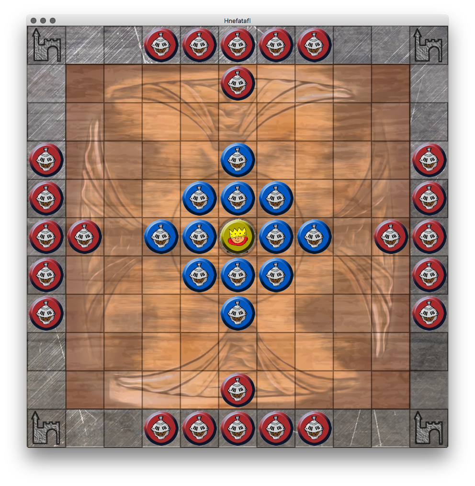

# Hnefatafl
An old board game for two. Work in Progress. [rules](http://aagenielsen.dk/copenhagen_rules.php)

## Todo
- [ ] pick a license that fits
- [ ] find free artwork and icons
- [ ] implement The shieldwall rule
- [ ] implement Exit forts rule
- [ ] implement total surround rule
- [ ] implement if a player can not move he loses rule
- [ ] implement Perpetual repetitions check, move a piece 3 times back and forth and you lose
- [ ] implement game is a draw when no capture was made in the last 50 moves
- [x] make a test where a piece tries to sit on the throne, fail
- [x] make a test where the king tires to sit on the throne, success
- [x] display whos turn it is
- [ ] display the amount of lost pieces
- [ ] implement player vs bot
- [ ] implement bot
- [ ] swap x and y in the structs
- [ ] rename GamePoint to BoardPosition and PieceMatrix to BoardMatrix

## Coordination Problems
* in Gamepoint x is the first value y the second
* in the array row is first and column second
* this means y=col, x=row

## Network Design
Some cheat detection:
* send gamemove, old-board, new-board to other player
* other player compares his board with the old board
* other player does the gamemove on his board
* other player compares his new board with new-board
UI Update
* animate the new move
* compare new with old board, fade all pieces that have died out

## AI Design
* move pieces down and in the opposite area of the attacker
* move piece so that they not touch enemy piece
* wants to kill enemy but not be killed minmax!
* avoid moving next to an enemy piece

## special tiles
thrones = all pieces pass over the throne but only the king can sit on it
tower = act like allie to defender, cant be moved on by attacker or defender, if king moves to tower he wins

## minmax explained
* http://neverstopbuilding.com/minimax

## Possible re-implementation of Board
* a class with subscripting
* class with isEqual
* class with custom serialze

## Notes
* Grid is zero based, mid is 5,5
* SK origin is bottom left, i use top left

## Where did the design go wrong?
* I am missing map reduce -> maybe use http://underscorem.org
* i want to add functions to the structs

## Resources
* [testing assertions](https://developer.apple.com/library/ios/documentation/DeveloperTools/Conceptual/testing_with_xcode/testing_3_writing_test_classes/testing_3_writing_test_classes.html#//apple_ref/doc/uid/TP40014132-CH4-SW35)
* http://www.raywenderlich.com/29228/how-to-develop-an-ipad-board-game-app-part-12